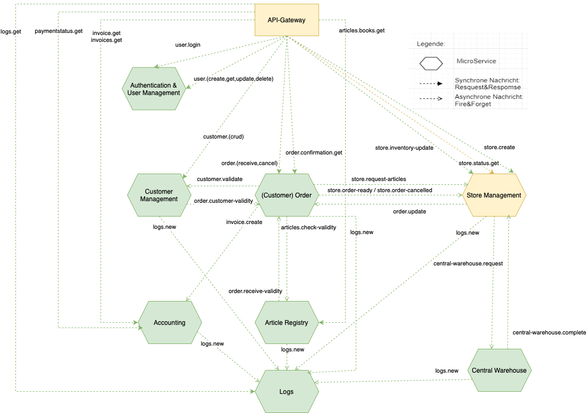

# Software Development and Architecture

This project was developed as part of the *Software Development and Architecture* course at the [Lucerne University of Applied Sciences and Arts (HSLU)](https://www.hslu.ch/de-ch/). The goal was to design and implement a distributed order system for a bookstore using a microservice architecture.

Each directory in this repository represents a separate microservice, which I have consolidated into a single repository for easier management. The system consists of 10 microservices that communicate asynchronously via [RabbitMQ](https://www.rabbitmq.com/).

## Microservice Architecture

